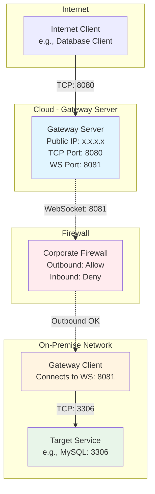
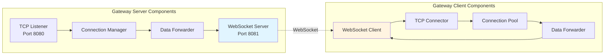
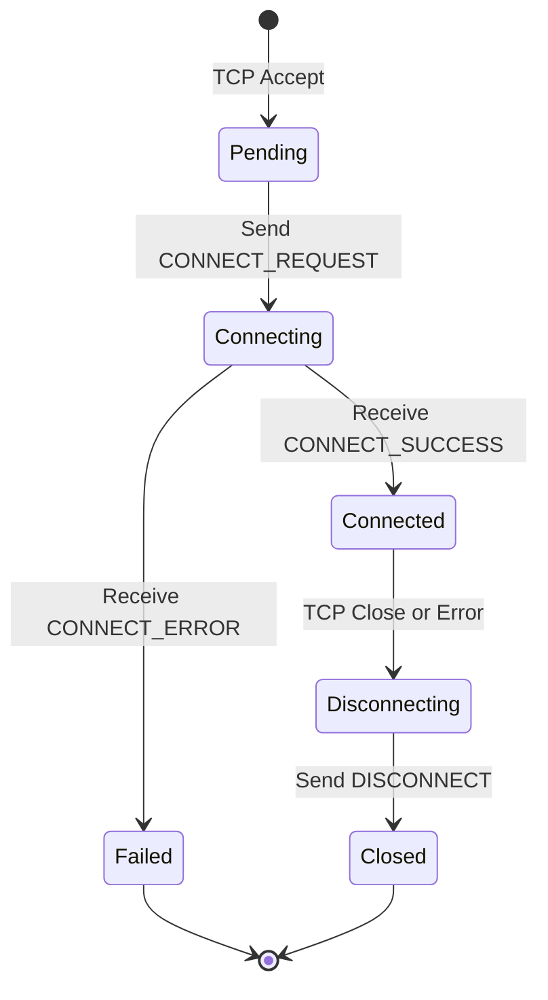
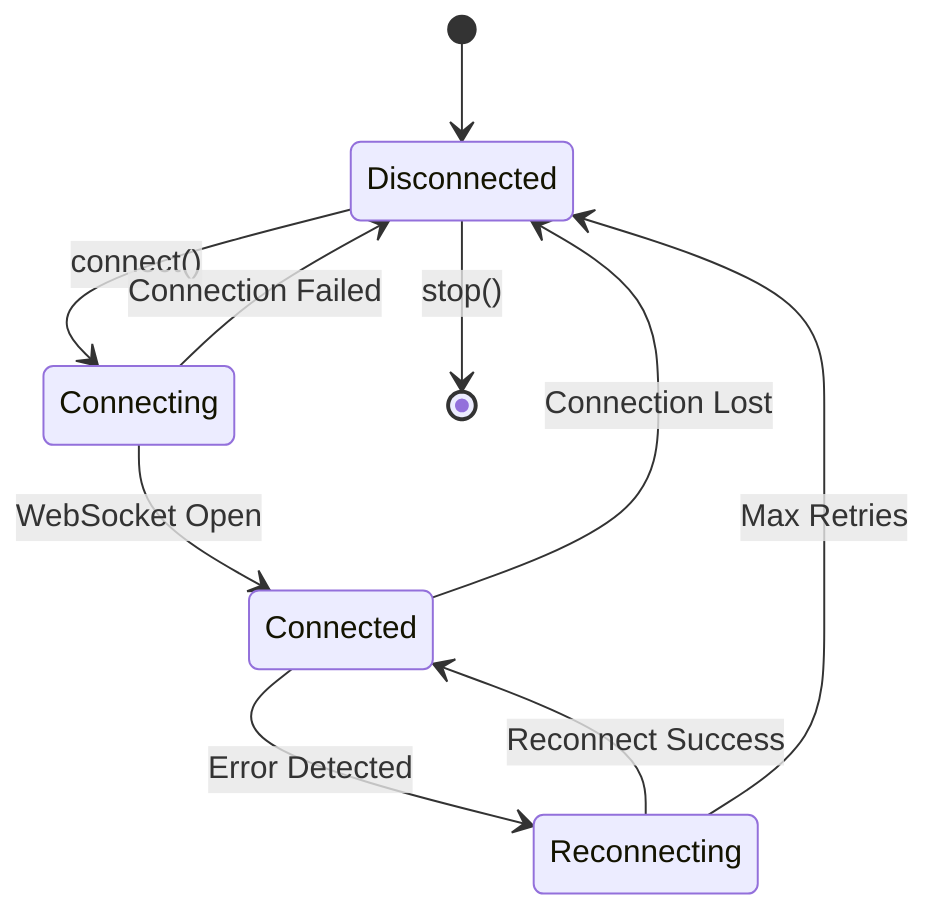
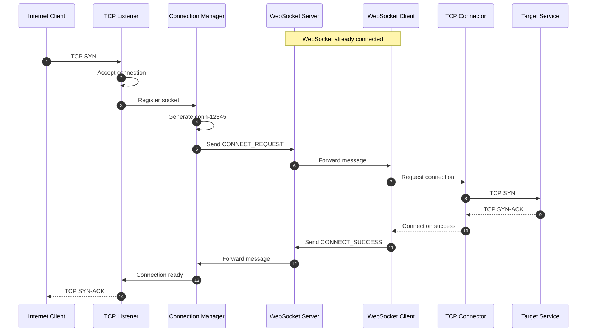
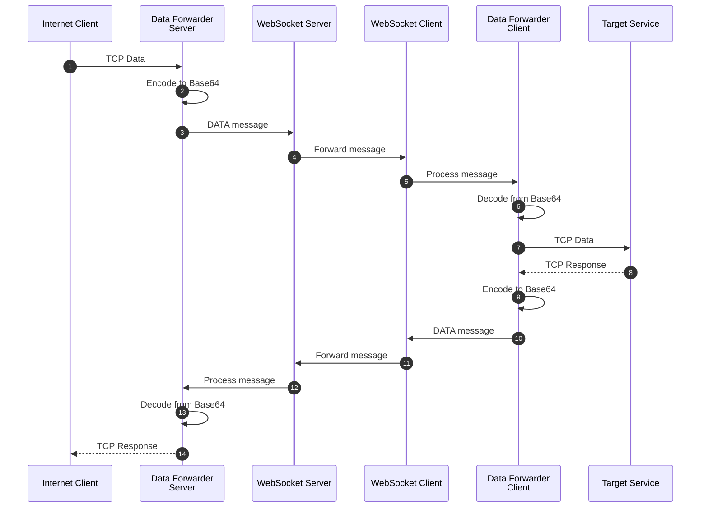
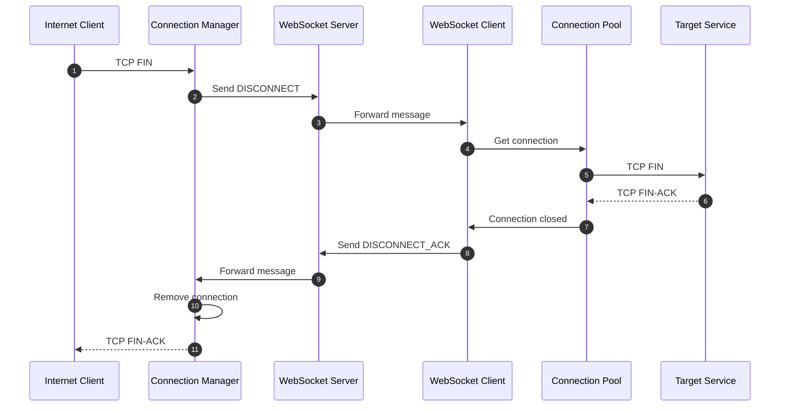
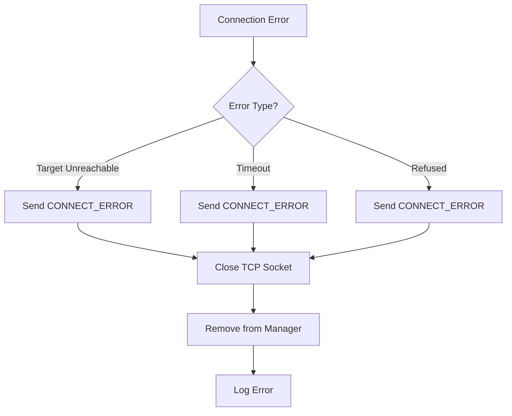
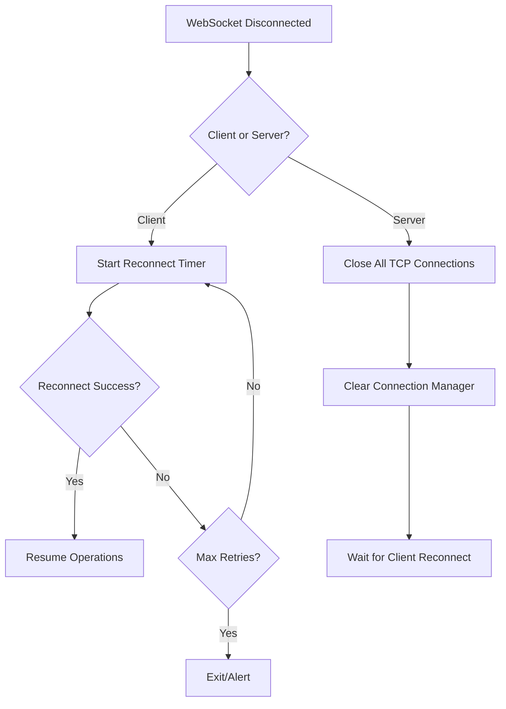
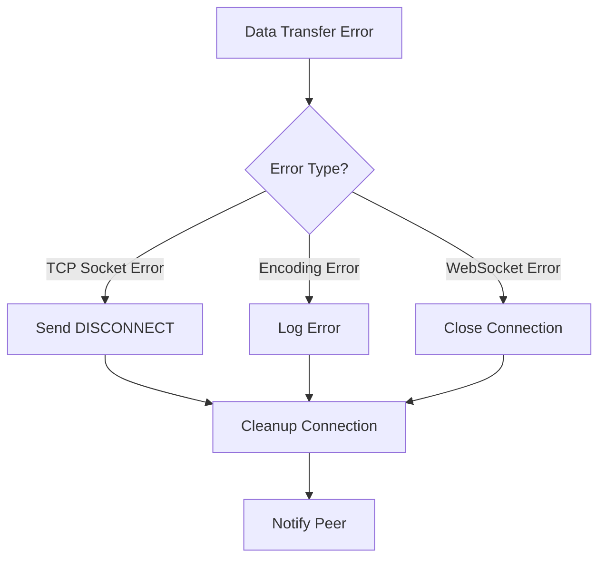

# YASG Architecture Document

## System Overview

YASG (Yet Another Secure Gateway) is a WebSocket-based TCP tunneling solution that enables secure access to on-premise services from the internet without requiring inbound firewall rules.

## Core Concepts

### The Problem
Traditional access to on-premise services requires:
- Opening inbound firewall ports
- Exposing services directly to the internet
- Complex VPN configurations

### The Solution
YASG uses an outbound WebSocket connection from the on-premise network to a cloud-based gateway server:
- Only outbound connections required (firewall-friendly)
- No direct exposure of on-premise services
- Simple configuration and deployment

## System Architecture

### Deployment Topology



### Component Interaction



## Detailed Component Design

### 1. Gateway Server

#### TCP Listener
**Purpose:** Accept incoming TCP connections from internet clients

**Responsibilities:**
- Listen on configured TCP port
- Accept new connections
- Generate unique connection IDs
- Hand off to Connection Manager

**Key Methods:**
```typescript
class TcpListener {
  start(): void
  stop(): void
  onConnection(callback: (socket: Socket, connectionId: string) => void): void
}
```

#### WebSocket Server
**Purpose:** Maintain persistent connection with gateway client

**Responsibilities:**
- Accept WebSocket connections
- Send/receive protocol messages
- Handle connection lifecycle
- Broadcast messages to connected clients

**Key Methods:**
```typescript
class WebSocketServer {
  start(): void
  stop(): void
  sendMessage(message: WebSocketMessage): void
  onMessage(callback: (message: WebSocketMessage) => void): void
  onClientConnected(callback: () => void): void
  onClientDisconnected(callback: () => void): void
}
```

#### Connection Manager
**Purpose:** Track and manage active TCP connections

**Responsibilities:**
- Map connection IDs to TCP sockets
- Track connection states
- Handle connection cleanup
- Enforce connection limits

**State Machine:**


**Key Methods:**
```typescript
class ConnectionManager {
  addConnection(connectionId: string, socket: Socket): void
  getConnection(connectionId: string): Socket | undefined
  removeConnection(connectionId: string): void
  getActiveConnections(): number
  closeAll(): void
}
```

#### Data Forwarder
**Purpose:** Forward data between TCP and WebSocket

**Responsibilities:**
- Read data from TCP socket
- Encode data for WebSocket transmission
- Decode data from WebSocket
- Write data to TCP socket
- Handle backpressure

**Key Methods:**
```typescript
class DataForwarder {
  forwardTcpToWebSocket(socket: Socket, connectionId: string): void
  forwardWebSocketToTcp(message: WebSocketMessage): void
  pause(connectionId: string): void
  resume(connectionId: string): void
}
```

### 2. Gateway Client

#### WebSocket Client
**Purpose:** Maintain persistent connection to gateway server

**Responsibilities:**
- Connect to gateway server
- Handle reconnection logic
- Send/receive protocol messages
- Monitor connection health

**Connection State Machine:**


**Key Methods:**
```typescript
class WebSocketClient {
  connect(): Promise<void>
  disconnect(): void
  sendMessage(message: WebSocketMessage): void
  onMessage(callback: (message: WebSocketMessage) => void): void
  isConnected(): boolean
}
```

#### TCP Connector
**Purpose:** Create connections to target on-premise services

**Responsibilities:**
- Connect to target host:port
- Handle connection errors
- Manage socket lifecycle
- Report connection status

**Key Methods:**
```typescript
class TcpConnector {
  connect(host: string, port: number): Promise<Socket>
  disconnect(socket: Socket): void
  onData(socket: Socket, callback: (data: Buffer) => void): void
  onError(socket: Socket, callback: (error: Error) => void): void
}
```

#### Connection Pool
**Purpose:** Manage multiple TCP connections to target services

**Responsibilities:**
- Track active connections by ID
- Create new connections on demand
- Clean up closed connections
- Enforce pool size limits

**Key Methods:**
```typescript
class ConnectionPool {
  addConnection(connectionId: string, socket: Socket): void
  getConnection(connectionId: string): Socket | undefined
  removeConnection(connectionId: string): void
  getPoolSize(): number
  closeAll(): void
}
```

#### Data Forwarder
**Purpose:** Forward data between WebSocket and TCP

**Responsibilities:**
- Read data from TCP socket
- Encode data for WebSocket transmission
- Decode data from WebSocket
- Write data to TCP socket
- Handle backpressure

**Key Methods:**
```typescript
class DataForwarder {
  forwardTcpToWebSocket(socket: Socket, connectionId: string): void
  forwardWebSocketToTcp(message: WebSocketMessage): void
  pause(connectionId: string): void
  resume(connectionId: string): void
}
```

## Protocol Flow Details

### Connection Establishment



### Data Transfer



### Connection Termination



## Error Handling Strategy

### Connection Errors



### WebSocket Disconnection



### Data Transfer Errors



## Performance Optimization

### Buffer Management

**Strategy:**
- Use Node.js streams for efficient memory usage
- Implement backpressure handling
- Limit buffer sizes to prevent memory exhaustion

**Implementation:**
```typescript
// Backpressure handling
socket.on('data', (data) => {
  const canContinue = websocket.send(data);
  if (!canContinue) {
    socket.pause();
    websocket.once('drain', () => socket.resume());
  }
});
```

### Connection Pooling

**Strategy:**
- Reuse connections when possible
- Implement connection timeout
- Monitor and clean up idle connections

**Metrics:**
- Active connections count
- Connection creation rate
- Connection lifetime distribution

### WebSocket Optimization

**Strategy:**
- Use binary frames for data (future)
- Implement message batching (future)
- Monitor WebSocket health with ping/pong

**Health Check:**
```typescript
setInterval(() => {
  websocket.ping();
  setTimeout(() => {
    if (!pongReceived) {
      websocket.terminate();
      reconnect();
    }
  }, 5000);
}, 30000);
```

## Configuration Management

### Server Configuration File

```json
{
  "tcp": {
    "host": "0.0.0.0",
    "port": 8080
  },
  "websocket": {
    "port": 8081,
    "path": "/gateway"
  },
  "connection": {
    "timeout": 30000,
    "maxConnections": 100
  },
  "logging": {
    "level": "info",
    "file": "./logs/server.log"
  }
}
```

### Client Configuration File

```json
{
  "server": {
    "url": "ws://gateway.example.com:8081/gateway",
    "reconnect": true,
    "reconnectInterval": 5000,
    "maxReconnectAttempts": 10
  },
  "target": {
    "host": "localhost",
    "port": 3306
  },
  "connection": {
    "timeout": 30000,
    "poolSize": 10
  },
  "logging": {
    "level": "info",
    "file": "./logs/client.log"
  }
}
```

## Monitoring and Observability

### Key Metrics

**Server Metrics:**
- Active TCP connections
- Active WebSocket connections
- Data throughput (bytes/sec)
- Connection success/failure rate
- Average connection duration

**Client Metrics:**
- WebSocket connection status
- Reconnection attempts
- Active TCP connections to target
- Data throughput (bytes/sec)
- Connection errors

### Logging Strategy

**Log Levels:**
- **ERROR**: Critical errors requiring immediate attention
- **WARN**: Warning conditions that should be reviewed
- **INFO**: Important informational messages
- **DEBUG**: Detailed debugging information

**Log Format:**
```json
{
  "timestamp": "2026-04-01T15:00:00.000Z",
  "level": "INFO",
  "component": "ConnectionManager",
  "connectionId": "conn-12345",
  "message": "Connection established",
  "metadata": {
    "targetHost": "localhost",
    "targetPort": 3306
  }
}
```

## Security Considerations

### Current PoC Limitations
- No authentication
- No encryption (ws:// instead of wss://)
- No access control
- No rate limiting

### Production Requirements

**Authentication:**
- Token-based authentication for client connections
- API key validation
- Certificate-based authentication (mTLS)

**Encryption:**
- TLS/SSL for WebSocket (wss://)
- End-to-end encryption for sensitive data
- Certificate management

**Access Control:**
- Whitelist/blacklist for target services
- IP-based restrictions
- Port-based restrictions

**Rate Limiting:**
- Connection rate limiting
- Data transfer rate limiting
- Per-client quotas

**Audit Logging:**
- Connection attempts
- Data transfer volumes
- Configuration changes
- Security events

## Testing Strategy

### Unit Tests
- Protocol message encoding/decoding
- Connection ID generation
- Configuration validation
- Error handling logic

### Integration Tests
- End-to-end connection flow
- Data transfer accuracy
- Connection cleanup
- Reconnection logic
- Error scenarios

### Load Tests
- Multiple concurrent connections
- High data throughput
- Connection churn
- Memory usage under load

### Manual Tests
- MySQL database access
- PostgreSQL database access
- SSH server access
- HTTP server access
- Custom TCP service access

## Deployment Guide

### Server Deployment

**Prerequisites:**
- Node.js v18 or higher
- Public IP address or domain
- Open ports: 8080 (TCP), 8081 (WebSocket)

**Steps:**
```bash
# Clone repository
git clone <repository-url>
cd yasg

# Install dependencies
npm install

# Configure server
cp config/server-config.example.json config/server-config.json
# Edit config/server-config.json

# Build
npm run build

# Start server
npm run start:server

# Or use PM2 for production
pm2 start dist/server/index.js --name yasg-server
```

### Client Deployment

**Prerequisites:**
- Node.js v18 or higher
- Network access to gateway server
- Access to target on-premise service

**Steps:**
```bash
# Clone repository
git clone <repository-url>
cd yasg

# Install dependencies
npm install

# Configure client
cp config/client-config.example.json config/client-config.json
# Edit config/client-config.json

# Build
npm run build

# Start client
npm run start:client

# Or use PM2 for production
pm2 start dist/client/index.js --name yasg-client
```

## Troubleshooting

### Common Issues

**Issue: Client cannot connect to server**
- Check firewall rules
- Verify server is running
- Check WebSocket URL configuration
- Review server logs

**Issue: Connection to target service fails**
- Verify target service is running
- Check host and port configuration
- Review network connectivity
- Check client logs

**Issue: Data transfer is slow**
- Check network bandwidth
- Review buffer sizes
- Monitor CPU usage
- Check for backpressure issues

**Issue: Connections drop frequently**
- Check network stability
- Review timeout settings
- Monitor WebSocket health
- Check for resource exhaustion

## Future Enhancements

### Phase 2: Production Features
- Authentication and authorization
- TLS/SSL support (wss://)
- Access control lists
- Rate limiting
- Audit logging

### Phase 3: Advanced Features
- Multiple client support
- Load balancing
- HTTP/HTTPS proxy mode
- Web-based management UI
- Metrics dashboard
- Configuration API

### Phase 4: Enterprise Features
- High availability
- Clustering support
- Database persistence
- Advanced monitoring
- Integration with identity providers
- Compliance reporting

## References

- [WebSocket Protocol RFC 6455](https://tools.ietf.org/html/rfc6455)
- [Node.js Net Module](https://nodejs.org/api/net.html)
- [Node.js Stream API](https://nodejs.org/api/stream.html)
- [ws Library Documentation](https://github.com/websockets/ws)
- IBM Cloud Secure Gateway (archived)