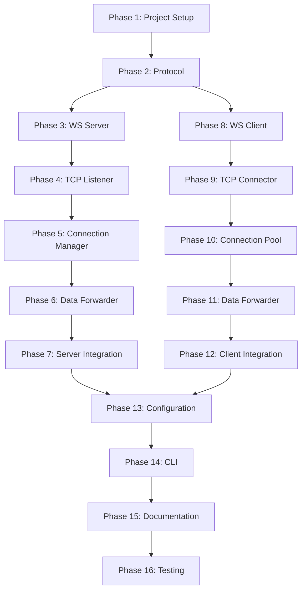

# YASG Implementation Roadmap

## Overview

This document provides a step-by-step implementation guide for building the YASG (Yet Another Secure Gateway) system. Each phase builds upon the previous one, ensuring a solid foundation before adding complexity.

## Implementation Phases

### Phase 1: Project Setup and Foundation
**Goal:** Set up the project structure and development environment

**Tasks:**
1. Initialize Node.js project with TypeScript
2. Configure build tools and scripts
3. Set up project directory structure
4. Create shared types and protocol definitions
5. Implement basic logging utilities

**Deliverables:**
- `package.json` with all dependencies
- `tsconfig.json` with TypeScript configuration
- Project directory structure
- Shared type definitions
- Basic utility functions

**Estimated Time:** 2-3 hours

---

### Phase 2: Protocol Implementation
**Goal:** Implement the WebSocket protocol and message handling

**Tasks:**
1. Define WebSocket message types and interfaces
2. Implement message encoding/decoding functions
3. Create connection ID generation utility
4. Implement data encoding (Base64) utilities
5. Write unit tests for protocol functions

**Deliverables:**
- [`src/shared/types.ts`](src/shared/types.ts) - Type definitions
- [`src/shared/protocol.ts`](src/shared/protocol.ts) - Protocol implementation
- [`src/shared/utils.ts`](src/shared/utils.ts) - Utility functions
- Unit tests for protocol

**Estimated Time:** 3-4 hours

---

### Phase 3: Gateway Server - WebSocket Server
**Goal:** Implement the WebSocket server component

**Tasks:**
1. Create WebSocketServer class
2. Implement connection handling
3. Add message send/receive functionality
4. Implement connection lifecycle events
5. Add basic error handling
6. Write unit tests

**Deliverables:**
- [`src/server/WebSocketServer.ts`](src/server/WebSocketServer.ts)
- WebSocket server tests
- Connection event handling

**Estimated Time:** 4-5 hours

---

### Phase 4: Gateway Server - TCP Listener
**Goal:** Implement the TCP listener component

**Tasks:**
1. Create TcpListener class
2. Implement TCP server setup
3. Add connection acceptance logic
4. Generate connection IDs for new connections
5. Implement connection event callbacks
6. Add error handling
7. Write unit tests

**Deliverables:**
- [`src/server/TcpListener.ts`](src/server/TcpListener.ts)
- TCP listener tests
- Connection ID generation

**Estimated Time:** 3-4 hours

---

### Phase 5: Gateway Server - Connection Manager
**Goal:** Implement connection tracking and management

**Tasks:**
1. Create ConnectionManager class
2. Implement connection storage (Map-based)
3. Add connection lifecycle methods
4. Implement connection state tracking
5. Add connection cleanup logic
6. Implement connection limits
7. Write unit tests

**Deliverables:**
- [`src/server/ConnectionManager.ts`](src/server/ConnectionManager.ts)
- Connection manager tests
- State management logic

**Estimated Time:** 3-4 hours

---

### Phase 6: Gateway Server - Data Forwarder
**Goal:** Implement bidirectional data forwarding

**Tasks:**
1. Create DataForwarder class
2. Implement TCP-to-WebSocket forwarding
3. Implement WebSocket-to-TCP forwarding
4. Add data encoding/decoding
5. Implement backpressure handling
6. Add error handling
7. Write unit tests

**Deliverables:**
- [`src/server/DataForwarder.ts`](src/server/DataForwarder.ts)
- Data forwarder tests
- Backpressure handling

**Estimated Time:** 4-5 hours

---

### Phase 7: Gateway Server - Integration
**Goal:** Integrate all server components

**Tasks:**
1. Create main server entry point
2. Wire up all components
3. Implement server lifecycle (start/stop)
4. Add configuration loading
5. Implement graceful shutdown
6. Add comprehensive logging
7. Write integration tests

**Deliverables:**
- [`src/server/index.ts`](src/server/index.ts)
- Server configuration
- Integration tests
- Server startup/shutdown logic

**Estimated Time:** 4-5 hours

---

### Phase 8: Gateway Client - WebSocket Client
**Goal:** Implement the WebSocket client component

**Tasks:**
1. Create WebSocketClient class
2. Implement connection logic
3. Add reconnection mechanism
4. Implement message send/receive
5. Add connection health monitoring
6. Implement ping/pong handling
7. Write unit tests

**Deliverables:**
- [`src/client/WebSocketClient.ts`](src/client/WebSocketClient.ts)
- WebSocket client tests
- Reconnection logic

**Estimated Time:** 5-6 hours

---

### Phase 9: Gateway Client - TCP Connector
**Goal:** Implement TCP connection to target services

**Tasks:**
1. Create TcpConnector class
2. Implement connection to target host:port
3. Add connection error handling
4. Implement socket lifecycle management
5. Add data event handling
6. Implement connection timeout
7. Write unit tests

**Deliverables:**
- [`src/client/TcpConnector.ts`](src/client/TcpConnector.ts)
- TCP connector tests
- Connection timeout handling

**Estimated Time:** 3-4 hours

---

### Phase 10: Gateway Client - Connection Pool
**Goal:** Implement connection pool management

**Tasks:**
1. Create ConnectionPool class
2. Implement connection storage
3. Add connection lifecycle methods
4. Implement pool size limits
5. Add connection cleanup
6. Implement connection tracking
7. Write unit tests

**Deliverables:**
- [`src/client/ConnectionPool.ts`](src/client/ConnectionPool.ts)
- Connection pool tests
- Pool management logic

**Estimated Time:** 3-4 hours

---

### Phase 11: Gateway Client - Data Forwarder
**Goal:** Implement bidirectional data forwarding

**Tasks:**
1. Create DataForwarder class
2. Implement TCP-to-WebSocket forwarding
3. Implement WebSocket-to-TCP forwarding
4. Add data encoding/decoding
5. Implement backpressure handling
6. Add error handling
7. Write unit tests

**Deliverables:**
- [`src/client/DataForwarder.ts`](src/client/DataForwarder.ts)
- Data forwarder tests
- Backpressure handling

**Estimated Time:** 4-5 hours

---

### Phase 12: Gateway Client - Integration
**Goal:** Integrate all client components

**Tasks:**
1. Create main client entry point
2. Wire up all components
3. Implement client lifecycle (start/stop)
4. Add configuration loading
5. Implement graceful shutdown
6. Add comprehensive logging
7. Write integration tests

**Deliverables:**
- [`src/client/index.ts`](src/client/index.ts)
- Client configuration
- Integration tests
- Client startup/shutdown logic

**Estimated Time:** 4-5 hours

---

### Phase 13: Configuration Management
**Goal:** Implement configuration system

**Tasks:**
1. Create configuration interfaces
2. Implement configuration loading from files
3. Add environment variable support
4. Implement configuration validation
5. Create example configuration files
6. Add configuration documentation
7. Write configuration tests

**Deliverables:**
- [`src/config/server-config.ts`](src/config/server-config.ts)
- [`src/config/client-config.ts`](src/config/client-config.ts)
- Example configuration files
- Configuration validation

**Estimated Time:** 3-4 hours

---

### Phase 14: CLI Implementation
**Goal:** Create command-line interfaces

**Tasks:**
1. Implement server CLI with argument parsing
2. Implement client CLI with argument parsing
3. Add help text and usage information
4. Implement version display
5. Add configuration file path option
6. Create startup scripts
7. Write CLI documentation

**Deliverables:**
- Server CLI implementation
- Client CLI implementation
- npm scripts for easy execution
- CLI documentation

**Estimated Time:** 3-4 hours

---

### Phase 15: Documentation
**Goal:** Create comprehensive documentation

**Tasks:**
1. Write README.md with overview
2. Create quick start guide
3. Write detailed usage guide
4. Document configuration options
5. Create troubleshooting guide
6. Add example use cases
7. Document API (if applicable)

**Deliverables:**
- [`README.md`](README.md)
- [`QUICKSTART.md`](QUICKSTART.md)
- [`USAGE_GUIDE.md`](USAGE_GUIDE.md)
- Configuration documentation
- Troubleshooting guide

**Estimated Time:** 4-5 hours

---

### Phase 16: Testing and Validation
**Goal:** Comprehensive testing of the system

**Tasks:**
1. End-to-end testing with HTTP server
2. Testing with MySQL database
3. Testing with PostgreSQL database
4. Testing with SSH server
5. Load testing with multiple connections
6. Error scenario testing
7. Performance benchmarking

**Deliverables:**
- Test results documentation
- Performance benchmarks
- Known issues list
- Test scripts

**Estimated Time:** 6-8 hours

---

## Implementation Order

### Recommended Sequence

### Parallel Development Opportunities

After Phase 2 (Protocol), the following can be developed in parallel:
- **Track 1:** Server components (Phases 3-7)
- **Track 2:** Client components (Phases 8-12)

This allows for faster development if multiple developers are available.

## Development Guidelines

### Code Quality Standards

1. **TypeScript Strict Mode:** Enable all strict type checking
2. **Error Handling:** All errors must be caught and logged
3. **Logging:** Use consistent logging format with levels
4. **Testing:** Minimum 80% code coverage
5. **Documentation:** All public APIs must be documented

### Git Workflow

1. Create feature branch for each phase
2. Commit frequently with clear messages
3. Write tests before merging
4. Code review before merging to main
5. Tag releases with semantic versioning

### Testing Strategy

**Unit Tests:**
- Test individual functions and classes
- Mock external dependencies
- Focus on edge cases and error conditions

**Integration Tests:**
- Test component interactions
- Use real WebSocket and TCP connections
- Test complete message flows

**End-to-End Tests:**
- Test complete system functionality
- Use real target services
- Verify data integrity

## Milestones

### Milestone 1: Server MVP (Phases 1-7)
**Goal:** Working gateway server that can accept TCP connections and forward via WebSocket

**Success Criteria:**
- Server starts successfully
- Accepts TCP connections
- Maintains WebSocket connection
- Forwards data (with mock client)

### Milestone 2: Client MVP (Phases 8-12)
**Goal:** Working gateway client that connects to server and forwards to target

**Success Criteria:**
- Client connects to server
- Establishes connections to target service
- Forwards data bidirectionally
- Handles reconnection

### Milestone 3: Complete System (Phases 13-14)
**Goal:** Fully functional system with configuration and CLI

**Success Criteria:**
- Configuration system works
- CLI interfaces functional
- Server and client work together
- Basic error handling in place

### Milestone 4: Production Ready (Phases 15-16)
**Goal:** Documented, tested, and validated system

**Success Criteria:**
- Complete documentation
- All tests passing
- Performance validated
- Known issues documented

## Risk Management

### Technical Risks

**Risk:** WebSocket connection instability
- **Mitigation:** Implement robust reconnection logic with exponential backoff
- **Contingency:** Add connection health monitoring and alerts

**Risk:** Data loss during transmission
- **Mitigation:** Implement message acknowledgment (future enhancement)
- **Contingency:** Add data integrity checks and logging

**Risk:** Memory leaks from connection accumulation
- **Mitigation:** Implement proper cleanup and connection limits
- **Contingency:** Add memory monitoring and automatic restart

**Risk:** Performance bottlenecks
- **Mitigation:** Implement backpressure handling and streaming
- **Contingency:** Add performance monitoring and optimization

### Schedule Risks

**Risk:** Underestimated complexity
- **Mitigation:** Break down tasks into smaller units
- **Contingency:** Prioritize core functionality, defer enhancements

**Risk:** Dependency issues
- **Mitigation:** Lock dependency versions, test thoroughly
- **Contingency:** Have fallback libraries identified

## Success Metrics

### Functional Metrics
- [ ] Server accepts TCP connections
- [ ] Client connects to server via WebSocket
- [ ] Data forwarded bidirectionally without corruption
- [ ] Connections cleaned up properly
- [ ] Reconnection works automatically
- [ ] Multiple concurrent connections supported

### Performance Metrics
- [ ] Latency < 50ms for local connections
- [ ] Throughput > 10 MB/s
- [ ] Support 100+ concurrent connections
- [ ] Memory usage < 100 MB under normal load
- [ ] CPU usage < 20% under normal load

### Quality Metrics
- [ ] Code coverage > 80%
- [ ] Zero critical bugs
- [ ] All documentation complete
- [ ] All tests passing
- [ ] Code review completed

## Post-Implementation

### Maintenance Plan
1. Monitor production usage
2. Collect user feedback
3. Fix bugs promptly
4. Plan feature enhancements
5. Update documentation

### Enhancement Roadmap
1. Add authentication
2. Implement TLS/SSL
3. Add access control
4. Create web UI
5. Add metrics dashboard
6. Support multiple clients
7. Implement load balancing

## Resources

### Required Skills
- Node.js and TypeScript
- WebSocket protocol
- TCP/IP networking
- Asynchronous programming
- Testing frameworks

### Development Tools
- VS Code or similar IDE
- Git for version control
- npm for package management
- Jest or Mocha for testing
- Postman or similar for API testing

### Reference Materials
- WebSocket RFC 6455
- Node.js documentation
- TypeScript handbook
- ws library documentation
- TCP/IP networking guides

## Conclusion

This roadmap provides a structured approach to implementing YASG. By following these phases sequentially and adhering to the guidelines, you can build a robust, maintainable, and well-tested secure gateway system.

**Total Estimated Time:** 60-75 hours

**Recommended Timeline:**
- Week 1-2: Phases 1-7 (Server)
- Week 3-4: Phases 8-12 (Client)
- Week 5: Phases 13-14 (Configuration & CLI)
- Week 6: Phases 15-16 (Documentation & Testing)

Good luck with the implementation!