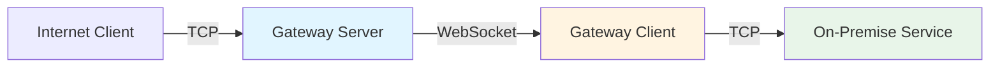
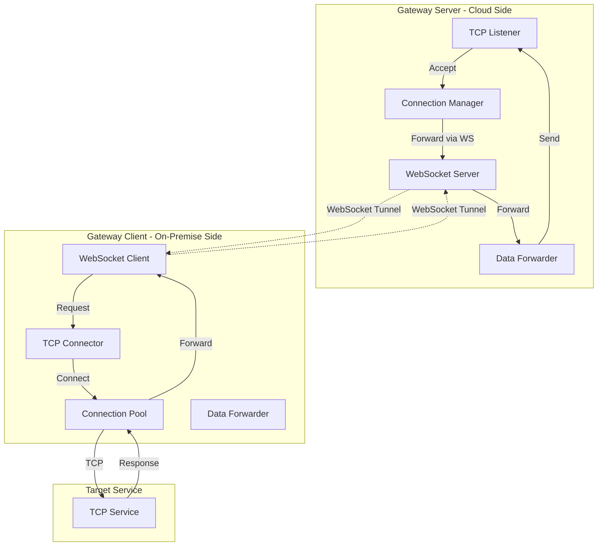
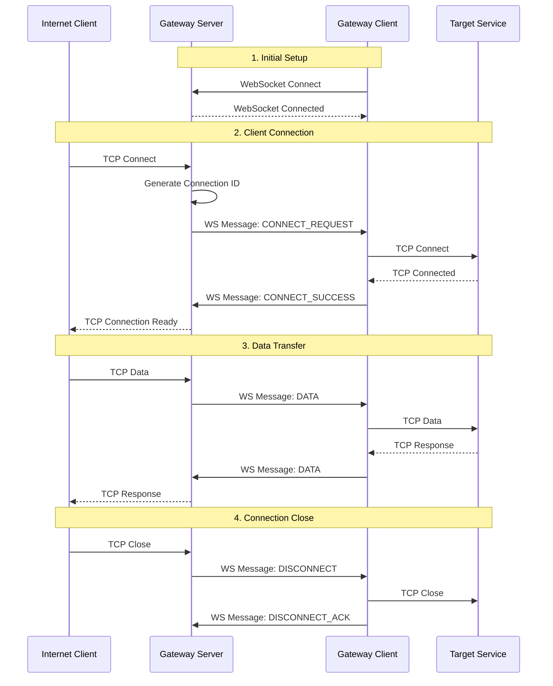

# YASG (Yet Another Secure Gateway) - Technical Specification

## Project Overview

YASG is a Node.js implementation of a secure gateway service similar to IBM Cloud Secure Gateway. It enables secure access to on-premise TCP services from the internet through a WebSocket-based tunnel, without requiring inbound firewall rules.

**Project Type:** Proof of Concept (PoC)  
**Scope:** WebSocket-based TCP tunneling, single client support, no authentication  
**Target Directory:** `c:/Users/KEIKIMURA/src/yasg`

## Architecture Overview

### High-Level Architecture



### Component Architecture



## System Components

### 1. Gateway Server (Cloud-Side)

**Responsibilities:**
- Accept TCP connections from internet clients
- Maintain WebSocket connection with gateway client
- Forward TCP data through WebSocket tunnel
- Manage connection lifecycle

**Key Modules:**
- `TcpListener`: Listens for incoming TCP connections
- `WebSocketServer`: Manages WebSocket connections with clients
- `ConnectionManager`: Tracks active connections and their states
- `DataForwarder`: Handles bidirectional data forwarding

### 2. Gateway Client (On-Premise-Side)

**Responsibilities:**
- Establish and maintain WebSocket connection to gateway server
- Connect to on-premise TCP services
- Forward data between WebSocket and TCP connections
- Handle reconnection logic

**Key Modules:**
- `WebSocketClient`: Maintains persistent connection to server
- `TcpConnector`: Creates connections to target services
- `ConnectionPool`: Manages multiple TCP connections
- `DataForwarder`: Handles bidirectional data forwarding

## Data Flow

### Connection Establishment Flow



## Protocol Design

### WebSocket Message Format

All messages are JSON-encoded with the following structure:

```typescript
interface WebSocketMessage {
  type: 'CONNECT_REQUEST' | 'CONNECT_SUCCESS' | 'CONNECT_ERROR' | 
        'DATA' | 'DISCONNECT' | 'DISCONNECT_ACK' | 'PING' | 'PONG';
  connectionId: string;
  data?: string;  // Base64-encoded binary data
  error?: string;
  timestamp: number;
}
```

### Message Types

1. **CONNECT_REQUEST**: Server requests client to connect to target service
   ```json
   {
     "type": "CONNECT_REQUEST",
     "connectionId": "conn-12345",
     "target": {
       "host": "localhost",
       "port": 3306
     },
     "timestamp": 1234567890
   }
   ```

2. **CONNECT_SUCCESS**: Client confirms successful connection
   ```json
   {
     "type": "CONNECT_SUCCESS",
     "connectionId": "conn-12345",
     "timestamp": 1234567890
   }
   ```

3. **CONNECT_ERROR**: Client reports connection failure
   ```json
   {
     "type": "CONNECT_ERROR",
     "connectionId": "conn-12345",
     "error": "Connection refused",
     "timestamp": 1234567890
   }
   ```

4. **DATA**: Bidirectional data transfer
   ```json
   {
     "type": "DATA",
     "connectionId": "conn-12345",
     "data": "SGVsbG8gV29ybGQ=",
     "timestamp": 1234567890
   }
   ```

5. **DISCONNECT**: Connection termination request
   ```json
   {
     "type": "DISCONNECT",
     "connectionId": "conn-12345",
     "timestamp": 1234567890
   }
   ```

## Project Structure

```
yasg/
├── package.json
├── tsconfig.json
├── README.md
├── TECHNICAL_SPEC.md
├── ARCHITECTURE.md
├── src/
│   ├── server/
│   │   ├── index.ts              # Server entry point
│   │   ├── TcpListener.ts        # TCP server implementation
│   │   ├── WebSocketServer.ts    # WebSocket server
│   │   ├── ConnectionManager.ts  # Connection tracking
│   │   └── DataForwarder.ts      # Data forwarding logic
│   ├── client/
│   │   ├── index.ts              # Client entry point
│   │   ├── WebSocketClient.ts    # WebSocket client
│   │   ├── TcpConnector.ts       # TCP connection handler
│   │   ├── ConnectionPool.ts     # Connection pool management
│   │   └── DataForwarder.ts      # Data forwarding logic
│   ├── shared/
│   │   ├── types.ts              # Shared TypeScript types
│   │   ├── protocol.ts           # Protocol definitions
│   │   └── utils.ts              # Utility functions
│   └── config/
│       ├── server-config.ts      # Server configuration
│       └── client-config.ts      # Client configuration
├── examples/
│   ├── server-example.ts
│   └── client-example.ts
└── tests/
    ├── server.test.ts
    └── client.test.ts
```

## Technology Stack

### Core Dependencies
- **Node.js**: Runtime environment (v18+)
- **TypeScript**: Type-safe development
- **ws**: WebSocket library
- **net**: Built-in TCP module

### Development Dependencies
- **@types/node**: Node.js type definitions
- **@types/ws**: WebSocket type definitions
- **tsx**: TypeScript execution
- **nodemon**: Development auto-reload

## Configuration

### Server Configuration

```typescript
interface ServerConfig {
  // TCP listener configuration
  tcp: {
    host: string;      // Default: '0.0.0.0'
    port: number;      // Default: 8080
  };
  
  // WebSocket server configuration
  websocket: {
    port: number;      // Default: 8081
    path: string;      // Default: '/gateway'
  };
  
  // Connection settings
  connection: {
    timeout: number;   // Default: 30000 (30s)
    maxConnections: number; // Default: 100
  };
}
```

### Client Configuration

```typescript
interface ClientConfig {
  // Gateway server connection
  server: {
    url: string;       // WebSocket URL
    reconnect: boolean; // Default: true
    reconnectInterval: number; // Default: 5000 (5s)
  };
  
  // Target service configuration
  target: {
    host: string;      // Target service host
    port: number;      // Target service port
  };
  
  // Connection settings
  connection: {
    timeout: number;   // Default: 30000 (30s)
    poolSize: number;  // Default: 10
  };
}
```

## Implementation Details

### Connection ID Generation

Connection IDs are generated using a combination of timestamp and random string:

```typescript
function generateConnectionId(): string {
  return `conn-${Date.now()}-${Math.random().toString(36).substr(2, 9)}`;
}
```

### Data Encoding

Binary data is Base64-encoded for transmission over WebSocket:

```typescript
function encodeData(buffer: Buffer): string {
  return buffer.toString('base64');
}

function decodeData(data: string): Buffer {
  return Buffer.from(data, 'base64');
}
```

### Error Handling

- **Connection Errors**: Logged and reported via CONNECT_ERROR message
- **Data Transfer Errors**: Connection closed and cleanup performed
- **WebSocket Errors**: Automatic reconnection attempted (client-side)
- **TCP Errors**: Connection terminated gracefully

## Performance Considerations

### Buffer Management
- Use streaming for large data transfers
- Implement backpressure handling
- Limit buffer sizes to prevent memory issues

### Connection Pooling
- Reuse TCP connections when possible
- Implement connection timeout and cleanup
- Monitor active connection count

### WebSocket Optimization
- Use binary frames for data transfer (future enhancement)
- Implement message compression (future enhancement)
- Monitor WebSocket health with ping/pong

## Security Considerations (Future Enhancements)

While this PoC does not include authentication, production implementations should consider:

1. **Authentication**: Token-based or certificate-based authentication
2. **Encryption**: TLS/SSL for WebSocket connections (wss://)
3. **Access Control**: Whitelist/blacklist for target services
4. **Rate Limiting**: Prevent abuse and DoS attacks
5. **Audit Logging**: Track all connection attempts and data transfers

## Testing Strategy

### Unit Tests
- Protocol message encoding/decoding
- Connection ID generation
- Configuration validation

### Integration Tests
- End-to-end connection establishment
- Data transfer accuracy
- Connection cleanup
- Error handling

### Manual Testing
- Connect to HTTP server
- Connect to database (MySQL, PostgreSQL)
- Connect to SSH server
- Test connection recovery

## Deployment

### Server Deployment
```bash
# Install dependencies
npm install

# Build TypeScript
npm run build

# Start server
npm run start:server
```

### Client Deployment
```bash
# Install dependencies
npm install

# Build TypeScript
npm run build

# Start client
npm run start:client
```

## Monitoring and Logging

### Log Levels
- **ERROR**: Critical errors requiring attention
- **WARN**: Warning conditions
- **INFO**: Informational messages (connections, disconnections)
- **DEBUG**: Detailed debugging information

### Metrics to Track
- Active connections count
- Data transfer volume
- Connection success/failure rate
- Average connection duration
- WebSocket reconnection count

## Future Enhancements

1. **Multiple Client Support**: Support multiple gateway clients
2. **Authentication**: Add token-based authentication
3. **TLS/SSL**: Secure WebSocket connections
4. **HTTP/HTTPS Proxy**: Add HTTP-specific optimizations
5. **Web UI**: Management dashboard
6. **Load Balancing**: Distribute connections across multiple clients
7. **Metrics Dashboard**: Real-time monitoring
8. **Configuration API**: Dynamic configuration updates

## References

- IBM Cloud Secure Gateway Documentation
- WebSocket Protocol (RFC 6455)
- Node.js Net Module Documentation
- Node.js Stream API Documentation